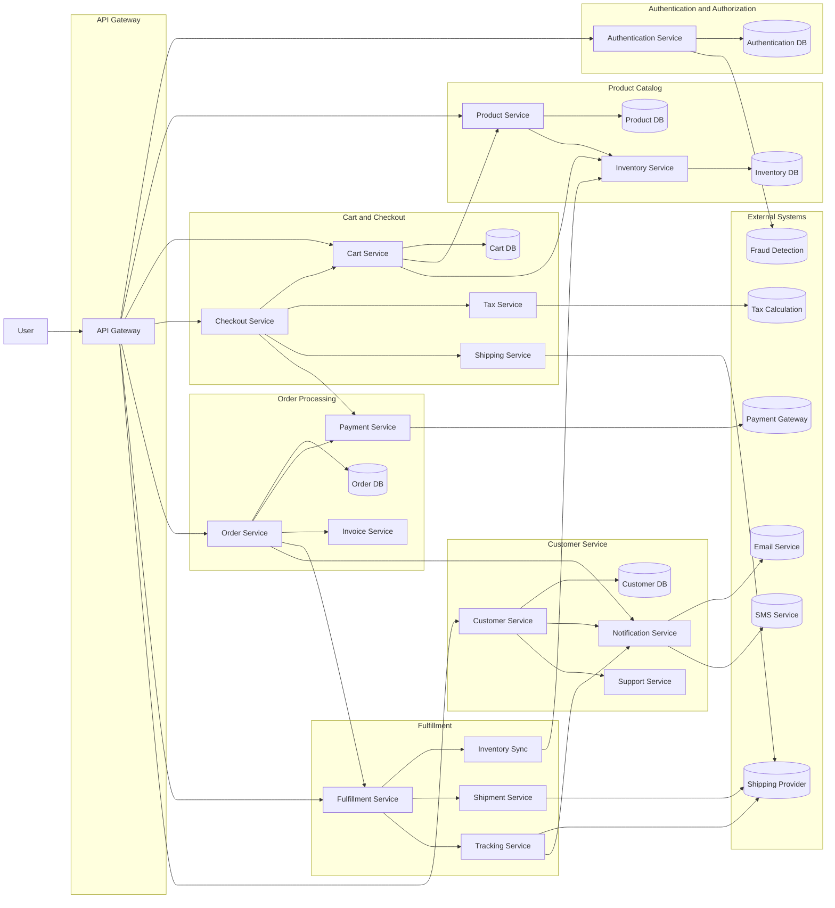

```mermaid

graph LR
    subgraph External Systems
        PaymentGateway[(Payment Gateway)]
        EmailService[(Email Service)]
        SmsService[(SMS Service)]
        FraudDetection[(Fraud Detection)]
        TaxCalculation[(Tax Calculation)]
        ShippingProvider[(Shipping Provider)]
    end

    subgraph API Gateway
        APIGateway[API Gateway]
    end

    subgraph Authentication and Authorization
        AuthService[Authentication Service]
        AuthDB[(Authentication DB)]
    end

    subgraph Product Catalog
        ProductService[Product Service]
        ProductDB[(Product DB)]
        InventoryService[Inventory Service]
        InventoryDB[(Inventory DB)]
    end

    subgraph Cart and Checkout
        CartService[Cart Service]
        CartDB[(Cart DB)]
        CheckoutService[Checkout Service]
        TaxService[Tax Service]
        ShippingService[Shipping Service]
    end

    subgraph Order Processing
        OrderService[Order Service]
        OrderDB[(Order DB)]
        PaymentService[Payment Service]
        InvoiceService[Invoice Service]
    end

    subgraph Fulfillment
        FulfillmentService[Fulfillment Service]
        InventorySync[Inventory Sync]
        ShipmentService[Shipment Service]
        TrackingService[Tracking Service]
    end

    subgraph Customer Service
        CustomerService[Customer Service]
        CustomerDB[(Customer DB)]
        NotificationService[Notification Service]
        SupportService[Support Service]
    end

    User[User] --> APIGateway
    APIGateway --> AuthService
    APIGateway --> ProductService
    APIGateway --> CartService
    APIGateway --> CheckoutService
    APIGateway --> OrderService
    APIGateway --> FulfillmentService
    APIGateway --> CustomerService

    AuthService --> AuthDB
    AuthService --> FraudDetection

    ProductService --> ProductDB
    ProductService --> InventoryService
    InventoryService --> InventoryDB

    CartService --> CartDB
    CartService --> ProductService
    CartService --> InventoryService

    CheckoutService --> CartService
    CheckoutService --> TaxService
    CheckoutService --> ShippingService
    CheckoutService --> PaymentService
    TaxService --> TaxCalculation
    ShippingService --> ShippingProvider

    OrderService --> OrderDB
    OrderService --> PaymentService
    OrderService --> InvoiceService
    OrderService --> FulfillmentService
    OrderService --> NotificationService
    PaymentService --> PaymentGateway

    FulfillmentService --> InventorySync
    FulfillmentService --> ShipmentService
    FulfillmentService --> TrackingService
    InventorySync --> InventoryService
    ShipmentService --> ShippingProvider
    TrackingService --> ShippingProvider
    TrackingService --> NotificationService

    CustomerService --> CustomerDB
    CustomerService --> NotificationService
    CustomerService --> SupportService
    NotificationService --> EmailService
    NotificationService --> SmsService

```