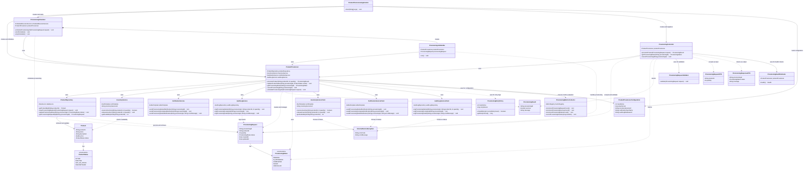

```mermaid
classDiagram
    class ProductProvisioner {
        -ProductRepository productRepository
        -InventoryService inventoryService
        -NotificationService notificationService
        -AuditLogService auditLogService
        +provisionProduct(String productId, int quantity): ProvisioningResult
        +updateProductStatus(String provisioningId, ProductStatus status): void
        +getProvisioningStatus(String provisioningId): ProvisioningStatus
        +cancelProvisioning(String provisioningId): void
        +scheduleProvisioningJob(ProvisioningRequest request): void
    }

    class ProductRepository {
        -DataSource dataSource
        +getProductById(String productId): Product
        +saveProvisioningRequest(ProvisioningRequest request): void
        +updateProvisioningStatus(String provisioningId, ProvisioningStatus status): void
        +getProvisioningRequestById(String provisioningId): ProvisioningRequest
    }

    class InventoryService {
        -RestTemplate restTemplate
        -String inventoryServiceUrl
        +reserveInventory(String productId, int quantity): boolean
        +releaseInventory(String productId, int quantity): void
        +getAvailableQuantity(String productId): int
    }

    class NotificationService {
        -KafkaTemplate kafkaTemplate
        +sendProvisioningStartedNotification(String provisioningId): void
        +sendProvisioningCompletedNotification(String provisioningId): void
        +sendProvisioningFailedNotification(String provisioningId, String errorMessage): void
    }

    class AuditLogService {
        -AuditLogRepository auditLogRepository
        +logProvisioningStarted(String provisioningId, String productId, int quantity): void
        +logProvisioningCompleted(String provisioningId): void
        +logProvisioningFailed(String provisioningId, String errorMessage): void
    }

    class ProvisioningRequest {
        -String provisioningId
        -String productId
        -int quantity
        -ProvisioningStatus status
        -Date createdAt
        -Date updatedAt
    }

    class Product {
        -String productId
        -String name
        -String description
        -double price
        -ProductStatus status
    }

    class ProvisioningResult {
        -String provisioningId
        -boolean success
        -String message
    }

    class ProvisioningStatus {
        <<enumeration>>
        PENDING
        IN_PROGRESS
        COMPLETED
        FAILED
        CANCELLED
    }

    class ProductStatus {
        <<enumeration>>
        ACTIVE
        INACTIVE
        OUT_OF_STOCK
        DISCONTINUED
    }

    ProductProvisioner --> ProductRepository: uses
    ProductProvisioner --> InventoryService: uses
    ProductProvisioner --> NotificationService: uses
    ProductProvisioner --> AuditLogService: uses
    ProductProvisioner ..> ProvisioningRequest: creates and manages
    ProductProvisioner ..> ProvisioningResult: returns
    ProductProvisioner ..> ProvisioningStatus: uses
    ProductRepository --> Product: retrieves and updates
    ProductRepository ..> ProvisioningRequest: persists and retrieves
    InventoryService ..> Product: checks availability
    AuditLogService ..> ProvisioningRequest: logs events
    Product --> ProductStatus: has
    ProvisioningRequest --> ProvisioningStatus: has

    class ProvisioningScheduler {
        -ScheduledExecutorService scheduledExecutorService
        -ProductProvisioner productProvisioner
        +scheduleProvisioningJob(ProvisioningRequest request): void
        +startScheduler(): void
        +stopScheduler(): void
    }

    class ProvisioningJobHandler {
        -ProductProvisioner productProvisioner
        -ProvisioningRequest provisioningRequest
        +run(): void
    }

    ProvisioningScheduler --> ProductProvisioner: uses
    ProvisioningScheduler ..> ProvisioningRequest: schedules provisioning
    ProvisioningScheduler *-- ProvisioningJobHandler: creates
    ProvisioningJobHandler --> ProductProvisioner: uses
    ProvisioningJobHandler ..> ProvisioningRequest: handles provisioning

    class ProvisioningController {
        -ProductProvisioner productProvisioner
        +provisionProduct(ProvisioningRequest request): ProvisioningResult
        +getProvisioningStatus(String provisioningId): ProvisioningStatus
        +cancelProvisioning(String provisioningId): void
    }

    class ProvisioningRequestValidator {
        +validate(ProvisioningRequest request): void
    }

    class InventoryServiceClient {
        -RestTemplate restTemplate
        -String inventoryServiceUrl
        +reserveInventory(String productId, int quantity): boolean
        +releaseInventory(String productId, int quantity): void
        +getAvailableQuantity(String productId): int
    }

    class NotificationServiceClient {
        -KafkaTemplate kafkaTemplate
        +sendProvisioningStartedNotification(String provisioningId): void
        +sendProvisioningCompletedNotification(String provisioningId): void
        +sendProvisioningFailedNotification(String provisioningId, String errorMessage): void
    }

    class AuditLogServiceClient {
        -AuditLogRepository auditLogRepository
        +logProvisioningStarted(String provisioningId, String productId, int quantity): void
        +logProvisioningCompleted(String provisioningId): void
        +logProvisioningFailed(String provisioningId, String errorMessage): void
    }

    ProvisioningController --> ProductProvisioner: uses
    ProvisioningController ..> ProvisioningRequest: accepts and validates
    ProvisioningController ..> ProvisioningStatus: returns
    ProvisioningController ..> ProvisioningResult: returns
    ProvisioningController --> ProvisioningRequestValidator: uses for validation
    ProductProvisioner --> InventoryServiceClient: uses
    ProductProvisioner --> NotificationServiceClient: uses
    ProductProvisioner --> AuditLogServiceClient: uses

    class ProvisioningResponseDTO {
        -String provisioningId
        -ProvisioningStatus status
        -String message
    }

    class ProvisioningRequestDTO {
        -String productId
        -int quantity
    }

    ProvisioningController ..> ProvisioningRequestDTO: accepts as input
    ProvisioningController ..> ProvisioningResponseDTO: returns as output

    class ProvisioningRetryPolicy {
        -int maxRetries
        -long retryInterval
        +shouldRetry(int currentRetryCount): boolean
        +getRetryInterval(): long
    }

    class ExternalServiceException {
        -String errorCode
        -String errorMessage
    }

    ProductProvisioner ..> ProvisioningRetryPolicy: uses for retry logic
    InventoryServiceClient ..> ExternalServiceException: throws on failure
    NotificationServiceClient ..> ExternalServiceException: throws on failure
    AuditLogServiceClient ..> ExternalServiceException: throws on failure

    class ProvisioningMetricsCollector {
        -MetricRegistry metricRegistry
        +incrementProvisioningRequestCount(): void
        +incrementProvisioningSuccessCount(): void
        +incrementProvisioningFailureCount(): void
        +recordProvisioningDuration(long duration): void
    }

    class ProvisioningHealthIndicator {
        -ProductProvisioner productProvisioner
        +health(): Health
    }

    ProductProvisioner --> ProvisioningMetricsCollector: uses for metrics collection
    ProvisioningController --> ProvisioningHealthIndicator: uses for health checks

    class ProductProvisionerConfiguration {
        -int maxRetries
        -long retryInterval
        -String inventoryServiceUrl
        -String notificationTopicName
        -String auditLogDatabaseUrl
    }

    ProductProvisioner --> ProductProvisionerConfiguration: uses for configuration

    class ProductProvisionerApplication {
        +main(String[] args): void
    }

    ProductProvisionerApplication --> ProductProvisioner: creates and initializes
    ProductProvisionerApplication --> ProvisioningScheduler: creates and starts
    ProductProvisionerApplication --> ProvisioningController: creates and registers
    ProductProvisionerApplication --> ProductProvisionerConfiguration: loads configuration

```