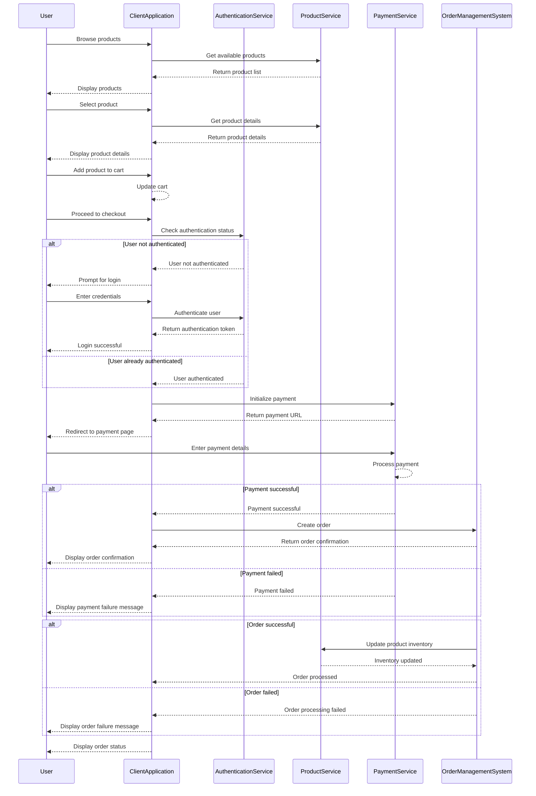

```mermaid
sequenceDiagram
    participant User
    participant ClientApplication
    participant AuthenticationService
    participant ProductService
    participant PaymentService
    participant OrderManagementSystem

    User->>ClientApplication: Browse products
    ClientApplication->>ProductService: Get available products
    ProductService-->>ClientApplication: Return product list
    ClientApplication-->>User: Display products

    User->>ClientApplication: Select product
    ClientApplication->>ProductService: Get product details
    ProductService-->>ClientApplication: Return product details
    ClientApplication-->>User: Display product details

    User->>ClientApplication: Add product to cart
    ClientApplication-->>ClientApplication: Update cart

    User->>ClientApplication: Proceed to checkout
    ClientApplication->>AuthenticationService: Check authentication status
    alt User not authenticated
        AuthenticationService-->>ClientApplication: User not authenticated
        ClientApplication-->>User: Prompt for login

        User->>ClientApplication: Enter credentials
        ClientApplication->>AuthenticationService: Authenticate user
        AuthenticationService-->>ClientApplication: Return authentication token
        ClientApplication-->>User: Login successful
    else User already authenticated
        AuthenticationService-->>ClientApplication: User authenticated
    end

    ClientApplication->>PaymentService: Initialize payment
    PaymentService-->>ClientApplication: Return payment URL

    ClientApplication-->>User: Redirect to payment page
    User->>PaymentService: Enter payment details
    PaymentService-->>PaymentService: Process payment
    alt Payment successful
        PaymentService-->>ClientApplication: Payment successful
        ClientApplication->>OrderManagementSystem: Create order
        OrderManagementSystem-->>ClientApplication: Return order confirmation
        ClientApplication-->>User: Display order confirmation
    else Payment failed
        PaymentService-->>ClientApplication: Payment failed
        ClientApplication-->>User: Display payment failure message
    end

    alt Order successful
        OrderManagementSystem->>ProductService: Update product inventory
        ProductService-->>OrderManagementSystem: Inventory updated
        OrderManagementSystem-->>ClientApplication: Order processed
    else Order failed
        OrderManagementSystem-->>ClientApplication: Order processing failed
        ClientApplication-->>User: Display order failure message
    end

    ClientApplication-->>User: Display order status

```